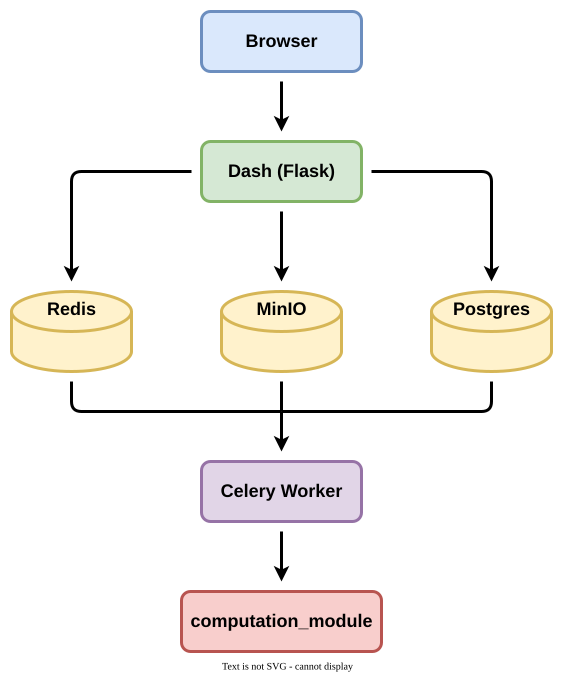

# Cosmo Template

A working reference app that showcases the Dash + Celery + PostgreSQL + MinIO framework
used by COSMOPOLITAN and COSMONAUT. The app demonstrates how to integrate a Python
computation module into the framework using a CSV statistical profiler as the example.

## Quick Start

```bash
./dev_up.sh
```

Open http://localhost:8080 to access the application.

Use `./dev_up.sh -d` to enable debug mode (auto-reload on code changes).

## Architecture

<div align="center">
  
</div>
### Services (docker-compose.yml)

| Service                 | Image             | Purpose                            |
| ----------------------- | ----------------- | ---------------------------------- |
| `cosmo-template`        | dev.Dockerfile    | Dash web app (Gunicorn)            |
| `cosmo-template-worker` | worker.Dockerfile | Celery worker                      |
| `postgres`              | postgres:15       | Job metadata, logs, Celery results |
| `redis`                 | redis:7           | Celery message broker              |
| `minio`                 | minio/minio       | Object storage for job files       |

### Data Flow

1. User uploads CSV and configures profiling parameters on the input page
2. Job is created in PostgreSQL, CSV and parameters saved to MinIO
3. User reviews configuration and submits the job on the job submission page
4. Celery worker picks up the task, downloads CSV and parameters from MinIO
5. `computation_module.py` runs the statistical profiler
6. Results (JSON) saved to MinIO, job status updated in PostgreSQL
7. Results page renders summary table, charts, and correlation heatmap

### Core Modules

| Module                      | Purpose                                                |
| --------------------------- | ------------------------------------------------------ |
| `app.py`                    | Dash app initialization and Flask server               |
| `celery_app.py`             | Celery worker entry point                              |
| `celery_config.py`          | Celery broker, result backend, and beat settings       |
| `computation_module.py`     | CSV statistical profiler (the example computation)     |
| `config.py`                 | Environment variable loading and validation            |
| `db_manager.py`             | SQLAlchemy models: Job, LogEntry                       |
| `error_handling.py`         | Central error handler and error modal                  |
| `job.py`                    | Job lifecycle: create work dir, save files, sync MinIO |
| `background_job_manager.py` | Celery app config, task submission                     |
| `layouts.py`                | Reusable layout components (navbar, page wrapper)      |
| `logger.py`                 | Logging configuration                                  |
| `object_storage_manager.py` | MinIO file operations via rclone                       |
| `pydantic_models.py`        | `ProfileConfig` — job configuration model              |

### Pages

| Page              | Path                       | Purpose                          |
| ----------------- | -------------------------- | -------------------------------- |
| Home              | `/`                        | Welcome page                     |
| Input             | `/input/<job_id>`          | Upload CSV, configure parameters |
| Job Submission    | `/job-submission/<job_id>` | Review config, submit, monitor   |
| Results           | `/results/<job_id>`        | View profiling results           |
| Job Management    | `/job-management`          | List/delete jobs                 |
| Logs              | `/logs`                    | Application log viewer           |
| Worker Management | `/worker-management`       | Celery worker status             |

## Environment Configuration

Three env files:

- `env_dev` — local Docker development
- `env_test` — local pytest (used by `run_pytest.sh`)
- `env_ci` — CI pipeline

`dev_up.sh` copies `env_dev` to `.env` on each run.

## Testing

```bash
# Full test suite (spins up Postgres, Redis, MinIO automatically)
./run_pytest.sh

# See available flags
./run_pytest.sh --help
```

Test files in `test/`:

- `test_computation_module.py` — unit tests for `profile_csv()`
- `test_db_manager.py` — database operations
- `test_background_job_manager.py` — Celery task submission
- `test_e2e.py` — Playwright end-to-end test
- `test_env.py` — environment variable completeness
- `test_html_id_enforcement.py` — HTML ID constant usage
- `conftest.py` — shared fixtures (database, MinIO, Celery)
- `help_functions_tests.py` — test utility helpers

When the E2E test fails, Playwright artifacts (screenshots, traces) are saved
to `test/artifacts/` for debugging.

## Setting Up Your Own Project

### 1. Bootstrap from the template

```bash
./copy.sh <new_project_name> <destination_directory>
# Example:
./copy.sh my_awesome_app /home/user/projects/my-awesome-app
```

This copies the template, renames all references, and prints a list of branded
files to customize (banner images, icons, home page text).

### 2. Replace the CSV profiler with your computation

In the new project directory:

1. **Replace `computation_module.py`** with your own computation logic
2. **Update `pydantic_models.py`** — change `ProfileConfig` to your config model
3. **Update `tasks/computation_tasks.py`** — adapt the Celery task to call your module
4. **Update `pages/input.py`** — adjust the upload/form for your input format
5. **Update `pages/results.py`** — display your computation's output
6. **Update tests** — replace `test_computation_module.py` with tests for your module

### 3. Extract your computation module (optional)

When your computation module grows beyond a single file, extract it into a separate
Python package:

1. Create a new git repo with its own `pyproject.toml` (publishable to PyPI or a
   private index)
2. Add it as a dependency in this project's `pyproject.toml`
3. Activate `docker-compose.local_pkg.yml`: update it to mount your local package
   checkout into web and worker containers
4. Enable `--local-computation-module` in `dev_up.sh`: remove the error guard, wire
   it to use the compose override file

See COSMOPOLITAN's `docker-compose.local-smp.yml` and COSMONAUT's
`docker-compose.local-sr.yml` as working examples of this pattern.

## Code Quality

```bash
# Pre-commit hooks
pre-commit install
pre-commit run --all-files
```

## File Structure

```
.
├── CLAUDE.md                      # AI assistant project instructions
├── copy.sh                        # Bootstrap new project from template
├── dev_up.sh                      # Start dev environment (docker-compose)
├── docker/                        # Dockerfiles
├── docker-compose.yml             # Service orchestration
├── docs/
│   ├── conventions/               # Coding conventions (mainly for AI assitant)
│   └── skills/                    # Step-by-step guides for common tasks (mainly for AI assitant)
├── env_*                          # Environment variable files (dev, test, ci)
├── run_pytest.sh                  # Test runner (spins up containers)
├── src/                           # Main application package
│   ├── app.py                     # Dash app initialization
│   ├── assets/                    # CSS, favicon
│   ├── background_job_manager.py  # Celery configuration
│   ├── celery_app.py              # Celery worker entry point
│   ├── celery_config.py           # Celery broker/beat settings
│   ├── computation_module.py      # CSV statistical profiler
│   ├── config.py                  # Environment variables
│   ├── constants/                 # HTML IDs, general constants
│   ├── db_manager.py              # SQLAlchemy models
│   ├── error_handling.py          # Central error handler
│   ├── job.py                     # Job lifecycle management
│   ├── layouts.py                 # Reusable layout components
│   ├── logger.py                  # Logging configuration
│   ├── object_storage_manager.py  # MinIO file operations via rclone
│   ├── pages/                     # Dash pages
│   │   ├── home.py
│   │   ...
│   ├── pydantic_models.py         # ProfileConfig model
│   ├── static/                    # Images, icons
│   ├── tasks/                     # Celery task definitions
│   │   ├── computation_tasks.py
│   │   ...
│   └── work_dir/                  # Runtime job working directories
│       ├── example_job_dir/
│       │   ├── logs
│       │   ├── parameters.json
│       │   ...
└── test/                          # All tests
    ├── artifacts/                 # Playwright artifacts on E2E failure
```
